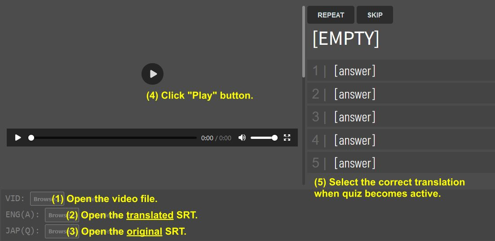

# Video Quiz
Make a quiz from the subtitles. Can be useful for language learners.

# How to use

Go to the [player's webpage](https://zegalur.github.io/video-quiz/player/). Then:

1. Open the video file.
2. Open the translated SRT file.
3. Open the original SRT file.
4. Play the video.
5. Select the right translation when the quiz becomes active.
6. Watch the next video segment, and so on.

