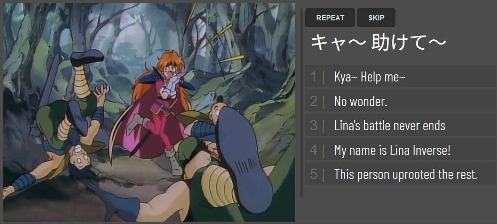

# Video Quiz
Make a quiz from the subtitles. Can be useful for language learners.

# How to use

Go to the [player's webpage](https://zegalur.github.io/video-quiz/player/). Then:

1. Open the video file.
2. Open the translated SRT file.
3. Open the original SRT file.
4. Play the video.
5. Select the correct translation when the quiz becomes active.
6. Watch the next video segment, and so on.

It's best not to use hand-translated SRT but instead to auto-translate the original SRT 
file so that the time codes match perfectly. There are plenty of free online SRT 
translation websites out there.

# Keyboard shortcuts

* **Repeat** current block: R or Numpad+
* **Skip** current question: S or Numpad_0
* **Answer** 1 to 5: 1 to 5 or Numpad_1 to Numpad_5
